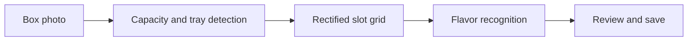

# CocoaVision — Know Every Piece in Every Box

CocoaVision is an offline, photo-based application built for the **Cocoa Dolce Chocolate Vision Build Track**. A cashier uploads one photograph of a completed chocolate box, and the app detects the box, identifies each chocolate, counts the flavors, and returns one structured record for the sale.

## What We Built

- Automatic support for **6, 10, 16, 30, and 50-piece boxes**
- Tray detection, perspective correction, and orientation-aware slot extraction
- Per-slot chocolate recognition and flavor totals
- Manual capacity selection when the box size is known
- Correction interface for changing a flavor or marking a slot empty
- JSON prediction records and JSONL correction logging
- Offline CPU inference through a FastAPI service and browser interface

## Pipeline



## Models

| Task | Model or method |
|---|---|
| Box capacity | EfficientNet-B0 five-class classifier with rotation averaging |
| Tray localization | EfficientNet-B0 U-Net segmentation with corner-regression fallback |
| Slot extraction | Perspective rectification and capacity-specific uniform grid |
| Flavor recognition | EfficientNet-B0 embeddings matched with flavor prototypes |

The models load once when the API starts. Inference runs locally without downloading weights.

## Requirements

- Python 3.9
- Tested environment: Python 3.9.25
- pip
- CPU or CUDA-supported PyTorch environment

## Run the App

```bash
git clone https://github.com/qasim418/Chocolathon.git
cd Chocolathon

python -m venv .venv
source .venv/bin/activate

python -m pip install -r requirements.txt

python Application/Deployment/chocolathon_api.py
```

Open **http://127.0.0.1:8000** and upload a JPEG or PNG photograph of a chocolate box.

## Real-Box Demo

Two real filled-box photographs are available in:

```text
Application/Demo/real_boxes/
```

Start the application, open `http://127.0.0.1:8000`, and upload either image to demonstrate automatic capacity detection, tray localization, slot extraction, flavor recognition, and correction logging.

These photographs are qualitative demonstrations and are not included in the generated validation metrics reported below.


## Validation

The final generated filled-box tests covered **57 images across all five capacities**. They achieved:

- **100% capacity accuracy**
- **100% exact flavor-count accuracy**
- **0 false-empty slots**
- **Below one second average CPU model processing** in both test groups

These are generated development-set results. Independent accuracy on a large collection of unseen real filled boxes is not yet established. Blur, glare, unusual angles, partially empty boxes, and visually similar chocolates may still require cashier review.

For architecture details, validation commands, output fields, repository structure, and limitations, see [TECHNICAL_DETAILS.md](TECHNICAL_DETAILS.md).