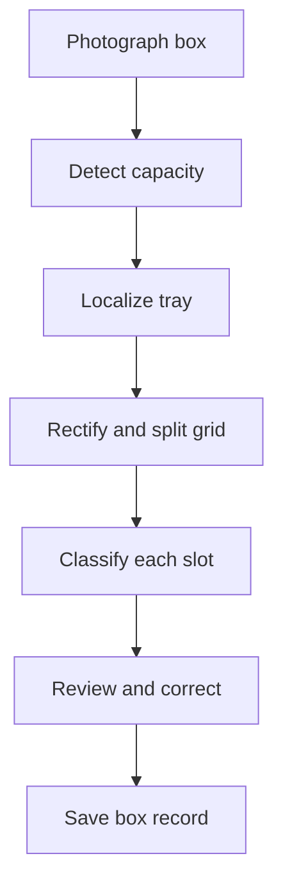

# CocoaVision — Technical Details

CocoaVision is an offline, photo-based chocolate box capture system built for the **Cocoa Dolce Chocolate Vision Build Track**. A cashier photographs a completed box, and the application detects the box size, localizes the tray, identifies every chocolate, counts each flavor, and produces one structured record for the sale. If a prediction is wrong, the cashier can correct that slot before saving; the correction is logged for future model improvement.

## The Problem

Cocoa Dolce records each sale, but not the individual chocolates placed in each hand-packed box. Asking customers or cashiers to enter every piece manually would slow the line. The challenge was therefore to capture the box contents in only a few seconds, without adding work for the customer and without requiring cloud inference.

## Our Solution

1. The cashier takes or uploads one photograph of the completed box.
2. CocoaVision automatically predicts a **6, 10, 16, 30, or 50-piece** layout. The cashier may also select a known size.
3. Tray segmentation finds the box, with routed corner-regression models as fallback.
4. Perspective correction converts the photographed tray into a clean, orientation-aware grid.
5. Each slot is matched to Cocoa Dolce flavor references using learned image embeddings.
6. The interface displays per-slot predictions and total flavor counts.
7. The cashier can correct any slot or mark it empty before saving.
8. Every prediction is available as structured JSON, while corrections are appended to `data/feedback/corrections.jsonl` for failure analysis and later model improvement.



## Why It Fits a Busy Counter

- One photograph captures the whole box; customers do nothing extra.
- Automatic mode handles five common box capacities.
- Known capacity can be selected when the cashier wants deterministic layout selection.
- Models load once when the API starts and inference runs locally on CPU.
- Incorrect predictions can be fixed by clicking a slot and choosing the correct chocolate.
- Saved corrections preserve both the original and corrected results, creating useful training evidence instead of discarding mistakes.

## Measured Validation

These results are from generated filled-box development tests, not an independent real-store accuracy study.

| Validation set | Images | Capacity accuracy | Exact flavor-count accuracy | False-empty slots | Mean CPU time |
|---|---:|---:|---:|---:|---:|
| New 10-slot set | 9 | 100% | 100% | 0 | 0.365 s/image |
| Existing 6/16/30/50 sets | 48 | 100% | 100% | 0 | 0.819 s/image |
| **Combined** | **57** | **100%** | **100%** | **0** | **Below 1 second/image in both tests** |

The end-to-end time visible in the application is measured for each request. Actual counter time also includes taking and reviewing the photograph.

## Output Record

The `/predict` endpoint returns one JSON record per box containing:

- Predicted or cashier-selected capacity
- Localization method and tray corners
- Row and column for every slot
- Predicted flavor, similarity, confidence margin, and review flag
- Occupied and empty counts
- Totals grouped by flavor
- Inference time and processing warnings

When a cashier changes a prediction, the `/feedback` endpoint records:

- Request ID
- Issue reason
- Original model prediction
- Corrected box record
- Individual slot changes
- Model version
- UTC timestamp

Corrections are stored locally in:

```text
data/feedback/corrections.jsonl
```

Each line is one independent JSON correction record.

## Architecture

| Stage | Implementation |
|---|---|
| Capacity detection | EfficientNet-B0 five-class classifier with four-orientation test-time averaging |
| Primary localization | EfficientNet-B0 U-Net tray segmentation |
| Localization fallback | Capacity-routed corner regressors |
| Slot extraction | Perspective rectification and orientation-aware uniform grids |
| Flavor recognition | EfficientNet-B0 embeddings matched against deployed flavor prototypes |
| Service | FastAPI with persistent model loading and serialized inference |
| Interface | Responsive web UI with pipeline visualizations, counts, review, corrections, and feedback saving |

The runtime is designed for offline use and does not download weights during inference.

## Capacity Detection

The capacity model supports:

```text
6, 10, 16, 30, and 50 slots
```

The system evaluates four rotations of the input photograph and averages the classifier probabilities. This makes capacity prediction less sensitive to whether the box was photographed in portrait or landscape orientation.

The cashier can bypass automatic capacity detection by selecting the known capacity in the interface.

## Tray Localization

Tray localization uses segmentation as the primary method:

1. The segmentation model predicts the tray region.
2. The tray polygon is extracted from the mask.
3. Four ordered tray corners are calculated.
4. The image is rectified with a perspective transformation.

If segmentation fails, the pipeline routes the image through a capacity-specific corner-regression model.

The API returns which localization method was used so fallback behavior remains visible.

## Orientation-Aware Slot Extraction

After localization, the detected tray is compared in width and height to determine its observed orientation. The expected row and column layout is rotated when necessary.

Supported base layouts are:

| Capacity | Rows | Columns |
|---:|---:|---:|
| 6 | 3 | 2 |
| 10 | 5 | 2 |
| 16 | 4 | 4 |
| 30 | 6 | 5 |
| 50 | 10 | 5 |

A landscape photograph may use the swapped orientation. For example, a 10-slot box can be extracted as either `5 × 2` or `2 × 5`, depending on how the physical box appears in the image.

The effective layout is returned as:

```json
{
  "layout_rows": 2,
  "layout_columns": 5
}
```

The API and browser interface use these returned values instead of assuming a fixed orientation.

## Flavor Recognition

Each rectified slot crop is passed through an EfficientNet-B0 feature extractor. The resulting embedding is compared with deployed flavor prototype embeddings using cosine similarity.

This approach allows the system to recognize chocolates using reference examples without training a large multiclass detector for every possible box arrangement.

For every slot, the result includes:

- Flavor identifier
- Flavor name
- Similarity score
- Confidence margin
- Occupied or empty label
- Review flag
- Row and column position

When `filled_only` mode is enabled, every extracted slot receives a chocolate flavor rather than being compared against the empty-slot class.

## Correction and Feedback Workflow

After inference, the cashier can click any slot in the result grid and:

- Choose another chocolate flavor
- Mark the slot as empty
- Restore or reset changes
- Select a reason for the correction
- Save all corrections

The interface recalculates:

- Occupied count
- Empty count
- Flavor totals
- Changed-slot indicators

The saved feedback contains both the model output and the final cashier-approved record. This allows later analysis of:

- Commonly confused flavors
- Errors associated with specific box capacities
- Low-confidence predictions
- Lighting and orientation problems
- Repeated localization or extraction issues

Feedback files are local operational data and should remain excluded from Git.

## API

The FastAPI service provides the following primary routes:

| Route | Method | Purpose |
|---|---|---|
| `/` | GET | Browser interface |
| `/api` | GET | Service information |
| `/health` | GET | Model and runtime health |
| `/predict` | POST | Run box inference |
| `/feedback` | POST | Save cashier corrections |
| `/docs` | GET | Interactive API documentation |

The application accepts JPEG and PNG uploads.

Models are initialized once during application startup rather than being reloaded for every request.

## Requirements

- Python 3.9
- Tested environment: Python 3.9.25
- pip
- CPU or CUDA-supported PyTorch environment

## Run Locally

```bash
git clone https://github.com/qasim418/Chocolathon.git
cd Chocolathon

python -m venv .venv
source .venv/bin/activate

python -m pip install -r requirements.txt


python Application/Deployment/chocolathon_api.py
```

Open:

```text
http://127.0.0.1:8000
```

API documentation is available at:

```text
http://127.0.0.1:8000/docs
```

## Real Filled-Box Demonstrations

The repository includes two real filled-box photographs under:

```text
Application/Demo/real_boxes/
```

These images can be used to run the complete application workflow:

1. Upload the original photograph.
2. Run automatic capacity detection.
3. Inspect the detected tray and rectified slot grid.
4. Review the per-slot flavor predictions and total counts.
5. Correct any incorrect flavor or empty-slot prediction.
6. Save the correction record.

The real photographs are qualitative demonstration examples. They are kept separate from the generated filled-box validation sets and are not included in the reported 57-image validation metrics.

## Runtime Configuration

The API supports environment-based configuration.

| Variable | Purpose | Default |
|---|---|---|
| `CHOCOLATHON_DEVICE` | Inference device such as `cpu` or `cuda` | `cpu` |
| `CHOCOLATHON_THREADS` | CPU inference threads | `1` |
| `CHOCOLATHON_BATCH_SIZE` | Slot-classification batch size | `8` |
| `CHOCOLATHON_MAX_UPLOAD_MB` | Maximum uploaded image size | `25` |
| `CHOCOLATHON_MAX_IMAGE_PIXELS` | Maximum decoded image pixels | `50000000` |

Example:

```bash
CHOCOLATHON_DEVICE=cpu \
CHOCOLATHON_THREADS=1 \
CHOCOLATHON_BATCH_SIZE=8 \
python Application/Deployment/chocolathon_api.py
```

## Reproduce the Filled-Box Tests

### Ten-slot validation

```bash
python Application/Runtime/chocolathon_inference.py \
  --root . \
  --test-synthetic \
  --synthetic-root data/synthetic_filled_boxes/v5_10_slot \
  --localizer segmentation \
  --filled-only \
  --threads 1 \
  --batch-size 8 \
  --output outputs/verification_10_slot
```

Expected summary:

```text
images: 9
capacity_accuracy: 1.0
exact_flavor_count_accuracy: 1.0
total_false_empty: 0
total_flavor_count_abs_error: 0
```

### Existing-capacity validation

```bash
python Application/Runtime/chocolathon_inference.py \
  --root . \
  --test-synthetic \
  --synthetic-root data/synthetic_filled_boxes/v4 \
  --localizer segmentation \
  --filled-only \
  --threads 1 \
  --batch-size 8 \
  --output outputs/verification_existing_sizes
```

Expected summary:

```text
images: 48
capacity_accuracy: 1.0
exact_flavor_count_accuracy: 1.0
total_false_empty: 0
total_flavor_count_abs_error: 0
```

## Repository Structure

```text
Application/
├── Deployment/
│   ├── chocolathon_api.py
│   ├── index.html
│   └── requirements-api.txt
├── Runtime/
│   └── chocolathon_inference.py
└── Release/
    └── Frozen release bundles

data/
├── boxes/
│   ├── raw/
│   ├── annotations/
│   ├── grid_annotations/
│   ├── normalized/
│   └── slots/
├── experiments/
│   ├── box_localization_v4/
│   ├── tray_segmentation_v1/
│   └── synthetic_slot_embeddings_v1/
├── feedback/
│   └── corrections.jsonl
└── synthetic_filled_boxes/
    ├── v4/
    └── v5_10_slot/

outputs/
└── Validation and diagnostic results
```

## Deployment Artifacts

The runtime uses three groups of deployed artifacts.

### Box localization

```text
data/experiments/box_localization_v4/deployment/
```

Contains:

- Five-class box-size classifier
- Small-box corner regressor
- Large-box corner regressor
- Localization configuration

### Tray segmentation

```text
data/experiments/tray_segmentation_v1/deployment/
```

Contains:

- Tray segmentation model
- Segmentation configuration

### Flavor recognition

```text
data/experiments/synthetic_slot_embeddings_v1/deployment/
```

Contains:

- Slot-embedding backbone
- Flavor prototype matrix
- Flavor catalog
- Recognition thresholds
- Deployment configuration

## Honest Limitations

- The reported 100% results are from generated development sets. Accuracy on a sufficiently large, independent collection of real filled boxes is not yet established.
- The intended workflow currently assumes a completed, filled box. Partially empty boxes, especially the newer 10-slot format, require more real examples and occupancy validation.
- Look-alike chocolates can be confused when their visible decoration is similar, obstructed, blurred, reflective, or affected by strong lighting.
- Capacity prediction can become uncertain on unfamiliar camera angles or box styles. The interface therefore allows a cashier to select the known capacity.
- A rush-hour counter study has not yet been completed. Model processing was below one second per image in the reported CPU tests, but total operational time must include image capture and human review.
- Very large boxes contain more slots and require more classification work, although the current 50-slot layout is supported.
- Segmentation depends on the visible tray boundary. Severe occlusion or cropping may trigger the corner-regression fallback or require another photograph.
- Correction records currently remain local and are not synchronized with a point-of-sale system.

## Operational Failure Handling

| Possible issue | Current handling |
|---|---|
| Incorrect capacity | Cashier selects the known capacity and reruns inference |
| Incorrect flavor | Cashier selects the slot and chooses the correct chocolate |
| Empty slot classified as occupied | Cashier marks the slot empty |
| Low-confidence prediction | Slot is marked for review |
| Segmentation failure | Routed corner-regression fallback is used |
| Poor photograph | Cashier retakes or uploads another image |
| Repeated model mistake | Saved feedback preserves the error for later analysis |

## Future Work

The next validation step is a timed counter pilot using unseen real boxes. This will measure the complete operational time, including:

- Taking the photograph
- Running inference
- Reviewing predictions
- Correcting mistakes
- Saving the box record

Saved correction logs can identify repeated flavor confusions and support targeted prototype updates.

Aggregated box records can then support the challenge’s stretch goal:

- Most frequently selected chocolates
- Common flavor combinations
- Demand patterns by box capacity
- Changes in customer preferences over time

## Summary

CocoaVision implements the complete capture flow from a single box photograph to a structured flavor record. It supports five box capacities, automatic tray localization, orientation-aware slot extraction, per-piece flavor recognition, human correction, and persistent feedback logging while running locally on CPU.

The project demonstrates a working Build Track prototype while clearly separating generated development results from real-world deployment claims.